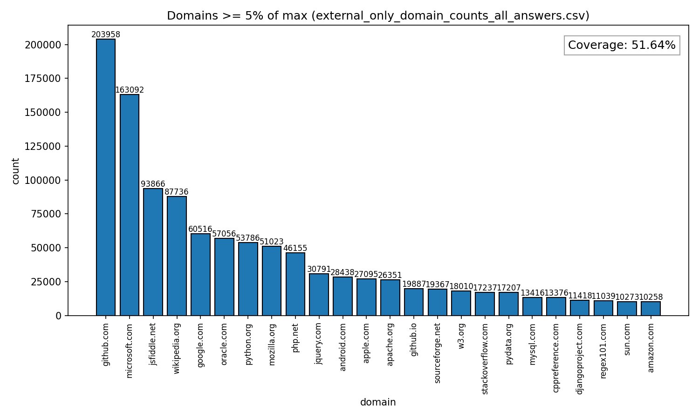

# Stack Overflow における External Link のドメイン出現数
論文「Stack Overflow におけるリンク分類とベストアンサーの関係分析」の補足資料です。

- 出現数が最多の github.com（203,958件）の5%以上である24ドメインを分析対象とした（External Link 全体の51.64%）
- データ：Google BigQuery 公開データセット bigquery-public-data.stackoverflow（2008/7/31〜2021/12/31）
